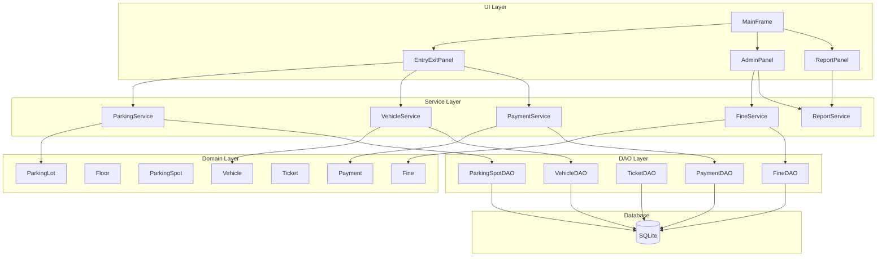
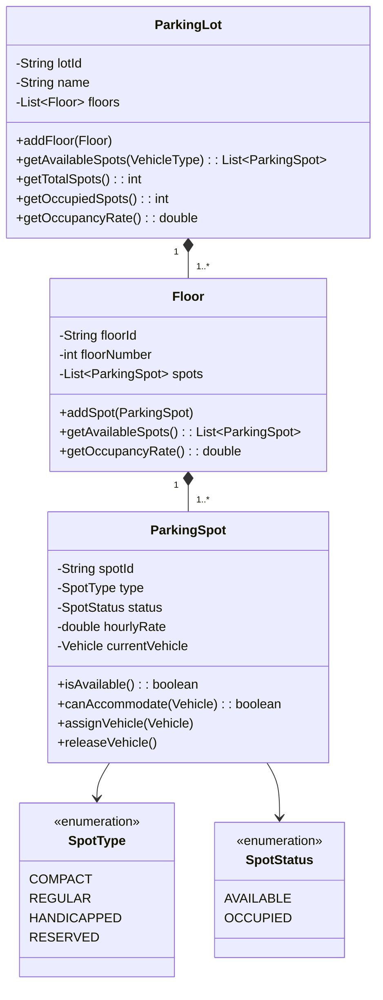
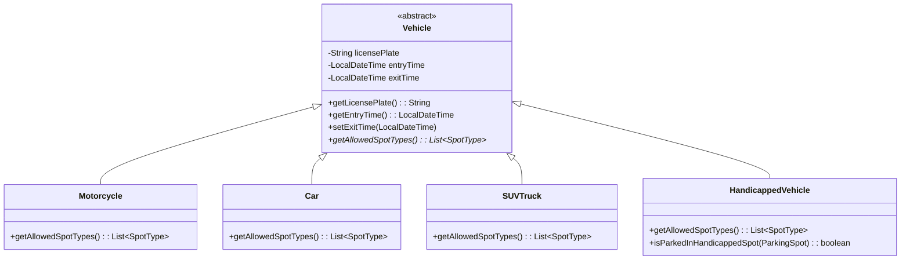
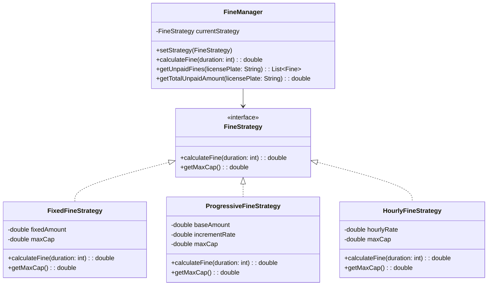

# Design Document: Parking Lot Management System

## Overview

本系统是一个基于 Java Swing 的本地桌面停车场管理应用，采用 MVC 架构模式，使用 SQLite 嵌入式数据库进行数据持久化。系统围绕 6 个核心业务域构建：停车结构、车辆管理、入场/出场流程、罚款管理、支付与收入、管理与报表。

### 设计原则
- **单一职责原则**: 每个类只负责一个业务功能
- **开闭原则**: 通过继承和策略模式支持扩展
- **依赖倒置**: UI 层依赖 Service 层，Service 层依赖 DAO 层
- **组合优于继承**: 停车场结构使用 Composite Pattern

## Architecture

### 整体架构图



### 分层架构说明

| 层级 | 职责 | 组件 |
|------|------|------|
| UI Layer | 用户交互、数据展示、输入校验 | MainFrame, Panels |
| Service Layer | 业务逻辑、流程编排、事务管理 | *Service 类 |
| Domain Layer | 业务对象、领域规则 | 实体类、值对象 |
| DAO Layer | 数据访问、SQL 操作 | *DAO 类 |
| Database | 数据存储 | SQLite |

## Components and Interfaces

### 1. Parking Structure Components (Composite Pattern)



### 2. Vehicle Hierarchy (Inheritance + Polymorphism)



**Vehicle Type 与 Spot Type 兼容性矩阵:**

| Vehicle Type | Allowed Spot Types |
|--------------|-------------------|
| Motorcycle | COMPACT, REGULAR |
| Car | COMPACT, REGULAR |
| SUVTruck | REGULAR |
| HandicappedVehicle | ALL (COMPACT, REGULAR, HANDICAPPED, RESERVED) |

### 3. Fine Strategy (Strategy Pattern)



### 4. Service Layer Interfaces

```java
// ParkingService Interface
public interface ParkingService {
    List<ParkingSpot> getAvailableSpots(VehicleType vehicleType);
    Ticket processEntry(String licensePlate, VehicleType vehicleType, String spotId);
    Receipt processExit(String licensePlate, PaymentMethod paymentMethod);
    double calculateParkingFee(Vehicle vehicle, ParkingSpot spot);
    ParkingLot getParkingLotStatus();
}

// FineService Interface
public interface FineService {
    void setFineStrategy(FineStrategy strategy);
    double calculateFine(int overtimeDuration);
    List<Fine> getUnpaidFines(String licensePlate);
    double getTotalUnpaidAmount(String licensePlate);
    void markFineAsPaid(String fineId);
}

// PaymentService Interface
public interface PaymentService {
    Payment processPayment(double amount, PaymentMethod method);
    Receipt generateReceipt(Payment payment, double parkingFee, double fineAmount);
}

// ReportService Interface
public interface ReportService {
    double getTotalRevenue(LocalDate startDate, LocalDate endDate);
    List<Vehicle> getCurrentlyParkedVehicles();
    List<Fine> getOutstandingFines();
    double getOccupancyRate();
}
```

### 5. DAO Layer Interfaces

```java
// Generic DAO Interface
public interface GenericDAO<T, ID> {
    T findById(ID id);
    List<T> findAll();
    void save(T entity);
    void update(T entity);
    void delete(ID id);
}

// ParkingSpotDAO
public interface ParkingSpotDAO extends GenericDAO<ParkingSpot, String> {
    List<ParkingSpot> findAvailableByType(SpotType type);
    ParkingSpot findByVehiclePlate(String licensePlate);
    void updateStatus(String spotId, SpotStatus status);
}

// VehicleDAO
public interface VehicleDAO extends GenericDAO<Vehicle, String> {
    Vehicle findByLicensePlate(String licensePlate);
    List<Vehicle> findCurrentlyParked();
}

// FineDAO
public interface FineDAO extends GenericDAO<Fine, String> {
    List<Fine> findUnpaidByLicensePlate(String licensePlate);
    double sumUnpaidByLicensePlate(String licensePlate);
}
```

## Data Models

### Entity Classes

```java
// Ticket (Value Object)
public class Ticket {
    private String ticketId;      // Format: T-{PLATE}-{TIMESTAMP}
    private String licensePlate;
    private String spotId;
    private LocalDateTime entryTime;
    
    public static String generateTicketId(String plate) {
        return "T-" + plate + "-" + System.currentTimeMillis();
    }
}

// Fine Entity
public class Fine {
    private String fineId;
    private String licensePlate;
    private double amount;
    private String reason;
    private LocalDateTime issuedTime;
    private boolean paid;
}

// Payment Entity
public class Payment {
    private String paymentId;
    private double amount;
    private PaymentMethod method;
    private LocalDateTime paymentTime;
}

// Receipt (Value Object)
public class Receipt {
    private String receiptId;
    private String licensePlate;
    private double parkingFee;
    private double fineAmount;
    private double totalAmount;
    private PaymentMethod paymentMethod;
    private LocalDateTime timestamp;
}

// Enumerations
public enum VehicleType {
    MOTORCYCLE, CAR, SUV_TRUCK, HANDICAPPED
}

public enum PaymentMethod {
    CASH, CARD
}
```

### Database Schema

```sql
-- parking_spot table
CREATE TABLE parking_spot (
    spot_id TEXT PRIMARY KEY,
    floor_id TEXT NOT NULL,
    type TEXT NOT NULL,
    status TEXT NOT NULL DEFAULT 'AVAILABLE',
    hourly_rate REAL NOT NULL,
    current_vehicle_plate TEXT
);

-- vehicle table
CREATE TABLE vehicle (
    license_plate TEXT PRIMARY KEY,
    vehicle_type TEXT NOT NULL,
    entry_time TEXT,
    exit_time TEXT,
    spot_id TEXT,
    FOREIGN KEY (spot_id) REFERENCES parking_spot(spot_id)
);

-- ticket table
CREATE TABLE ticket (
    ticket_id TEXT PRIMARY KEY,
    license_plate TEXT NOT NULL,
    spot_id TEXT NOT NULL,
    entry_time TEXT NOT NULL,
    FOREIGN KEY (license_plate) REFERENCES vehicle(license_plate),
    FOREIGN KEY (spot_id) REFERENCES parking_spot(spot_id)
);

-- fine table
CREATE TABLE fine (
    fine_id TEXT PRIMARY KEY,
    license_plate TEXT NOT NULL,
    amount REAL NOT NULL,
    reason TEXT,
    issued_time TEXT NOT NULL,
    paid INTEGER NOT NULL DEFAULT 0
);

-- payment table
CREATE TABLE payment (
    payment_id TEXT PRIMARY KEY,
    amount REAL NOT NULL,
    method TEXT NOT NULL,
    payment_time TEXT NOT NULL,
    license_plate TEXT,
    ticket_id TEXT,
    FOREIGN KEY (license_plate) REFERENCES vehicle(license_plate),
    FOREIGN KEY (ticket_id) REFERENCES ticket(ticket_id)
);
```

## Correctness Properties

*A property is a characteristic or behavior that should hold true across all valid executions of a system—essentially, a formal statement about what the system should do. Properties serve as the bridge between human-readable specifications and machine-verifiable correctness guarantees.*

### Property 1: Parking Structure Invariants
*For any* valid ParkingLot, it SHALL contain at least one Floor, and each Floor SHALL contain at least one ParkingSpot with a unique spotId, valid type, and initial status of AVAILABLE.
**Validates: Requirements 1.1, 1.2, 1.3, 1.4**

### Property 2: Spot Availability Filtering
*For any* vehicle type and parking lot state, all spots returned by getAvailableSpots(vehicleType) SHALL be both AVAILABLE and compatible with that vehicle type according to the compatibility matrix.
**Validates: Requirements 1.5**

### Property 3: Occupancy Rate Calculation
*For any* parking lot state, the occupancy rate SHALL equal the number of OCCUPIED spots divided by the total number of spots.
**Validates: Requirements 1.6**

### Property 4: Vehicle License Plate Requirement
*For any* created Vehicle, the licensePlate field SHALL be non-null and non-empty.
**Validates: Requirements 2.2**

### Property 5: Vehicle Spot Type Compatibility
*For any* Vehicle subclass, getAllowedSpotTypes() SHALL return a non-empty list containing only valid SpotType values, and the returned types SHALL match the defined compatibility matrix.
**Validates: Requirements 2.3**

### Property 6: HandicappedVehicle Pricing Rules
*For any* HandicappedVehicle, if parked in a HANDICAPPED spot, the effective hourly rate SHALL be zero; if parked in any other spot type, the effective hourly rate SHALL be RM2/hour.
**Validates: Requirements 2.5, 2.6**

### Property 7: Spot Assignment Validation
*For any* successful vehicle entry, the assigned ParkingSpot SHALL have been AVAILABLE before assignment, SHALL be compatible with the vehicle type, and after assignment SHALL have status OCCUPIED with currentVehicle set to the entered vehicle.
**Validates: Requirements 3.4, 3.5**

### Property 8: Ticket Format Consistency
*For any* generated Ticket, the ticketId SHALL match the pattern "T-{licensePlate}-{timestamp}" where timestamp is a valid numeric value.
**Validates: Requirements 3.6**

### Property 9: Parking Fee Calculation
*For any* parking session with entry time E and exit time X, the parking duration SHALL be ceiling((X - E) in hours), and the parking fee SHALL equal duration multiplied by the spot's hourlyRate.
**Validates: Requirements 4.2, 4.3**

### Property 10: Spot Release on Exit
*For any* completed vehicle exit, the previously occupied ParkingSpot SHALL have status AVAILABLE and currentVehicle set to null.
**Validates: Requirements 4.6**

### Property 11: Fine Strategy Application
*For any* fine calculation after a strategy change, the new strategy SHALL be used for all calculations, and the result SHALL be consistent with that strategy's algorithm.
**Validates: Requirements 5.2**

### Property 12: Fine Persistence and Aggregation
*For any* Fine, it SHALL be associated with a licensePlate (not a ticketId), SHALL persist across multiple entry/exit sessions until marked as paid, and getTotalUnpaidAmount(licensePlate) SHALL equal the sum of all unpaid fine amounts for that plate.
**Validates: Requirements 5.3, 5.4, 5.6**

### Property 13: Fine Maximum Cap
*For any* fine calculation with a configured maxCap, the calculated fine amount SHALL NOT exceed the maxCap value.
**Validates: Requirements 5.5**

### Property 14: Payment Recording
*For any* processed Payment, it SHALL have non-null amount, method, and paymentTime fields.
**Validates: Requirements 6.2**

### Property 15: Receipt Completeness and Total Calculation
*For any* generated Receipt, it SHALL contain parkingFee, fineAmount, totalAmount, and paymentMethod fields, and totalAmount SHALL equal parkingFee plus fineAmount.
**Validates: Requirements 6.4**

### Property 16: Payment Failure Handling
*For any* failed or cancelled payment, the associated ParkingSpot SHALL remain in OCCUPIED status with the vehicle still assigned.
**Validates: Requirements 6.5**

## Error Handling

### Input Validation Errors
| Error Condition | Handling Strategy |
|-----------------|-------------------|
| Empty license plate | Display error via JOptionPane, prevent operation |
| No vehicle type selected | Display error via JOptionPane, prevent entry |
| No spot selected | Display error via JOptionPane, prevent entry |
| License plate not found | Display error via JOptionPane, prevent exit |
| Spot already occupied | Display error via JOptionPane, suggest another spot |

### Database Errors
| Error Condition | Handling Strategy |
|-----------------|-------------------|
| Connection failure | Display error, retry connection, log error |
| SQL execution error | Rollback transaction, display error, log details |
| Data integrity violation | Display error, prevent operation |

### Business Logic Errors
| Error Condition | Handling Strategy |
|-----------------|-------------------|
| Incompatible vehicle-spot | Reject assignment, return validation error |
| Payment amount mismatch | Reject payment, display correct amount |
| Negative duration | Log warning, use minimum 1 hour |

## Testing Strategy

### Unit Testing
- Test each domain class independently (ParkingSpot, Vehicle subclasses, Fine, Payment)
- Test DAO implementations with in-memory SQLite database
- Test Service layer methods with mocked DAOs
- Focus on edge cases: empty inputs, boundary values, null handling

### Property-Based Testing
- Use JUnit 5 with jqwik library for property-based testing
- Minimum 100 iterations per property test
- Each property test references its design document property
- Tag format: **Feature: parking-lot-management, Property {number}: {property_text}**

### Integration Testing
- Test complete entry flow: input → validation → spot assignment → ticket generation
- Test complete exit flow: lookup → fee calculation → payment → spot release
- Test fine accumulation across multiple sessions
- Test strategy switching effects

### Test Coverage Goals
| Component | Target Coverage |
|-----------|-----------------|
| Domain Classes | 90% |
| Service Layer | 85% |
| DAO Layer | 80% |
| UI Layer | Manual testing |

### Testing Tools
- JUnit 5: Unit and integration testing framework
- jqwik: Property-based testing library for Java
- Mockito: Mocking framework for service layer tests
- SQLite in-memory mode: Database testing without file I/O

